# Pytorch_Audio

`Pytorch`, `Python=3.6`, `Windows10`, `CNN`, `Librosa`, `PyAudio`


## 0. Index

1. 개요
2. 라이브러리 설치
3. 데이터셋(UrbanSound) 다운로드
4. 전처리(1초 분할)
5. 전처리(Mfcc)
6. 학습


## 1. 개요

- **Pytorch의 CNN**, **Librosa**와 **PyAudio**를 통한 **Audio_Classification**(소리 구별)

- **Librosa**와 **PyAudio**를 이용해 **소리파일**(`.wav`, `.flac`)들을 **시각화**(스펙트로그램)이미지로 변환하여 **CNN**(Convolutional Neural Netowrk)를 통해 구별하도록 구현(**소리 구별 중심**)

  

  ###### [ Spectrogram Example ]

  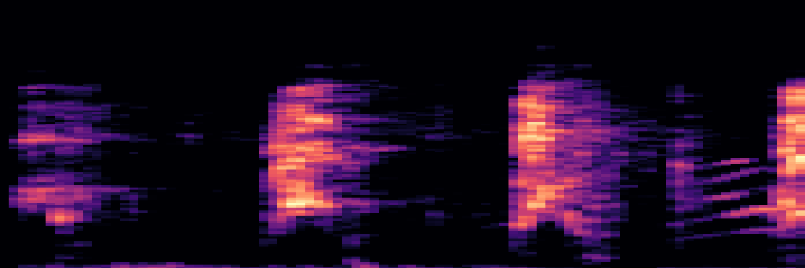

  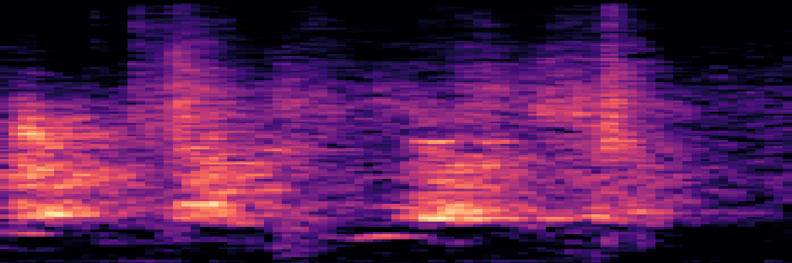


## 2. 라이브러리 설치

- ##### 설치해야할 라이브러리

  - **Pytorch**(이미 상위 폴더의 [README](https://github.com/deongjin/Pytorch_Project/blob/master/README.md)에서 설치함)
  - **Librosa**(Python에서 많이 쓰이는 음성 파일 분석 프로그램)
  - **Pydub**(audio file의 channel이 mono가 아닌 stereo일 경우, mono로 변경하기 위함)
  - **PyAudio**(Audio 녹음 및 재생)

- ##### PIP를 이용한 라이브러리 설치

  - > **pip**는 파이썬으로 작성된 패키지 소프트웨어를 설치 · 관리하는 패키지 관리 시스템이다.

  - **Anaconda Prompt를 실행한다**

    

  - **가상환경 활성화**

    ```shell
    (base)C:\Users\(username)> conda activate (가상환경 이름)
    ```

    `conda activate`를 통해 설치 되어있는 Pytorch가 설치된 가상환경에 접속한다.

  - **pip install**

    ```shell
    (testVenv)C:\Users\(username)> pip install Librosa Pydub PyAudio
    ```

    ###### [Librosa]

    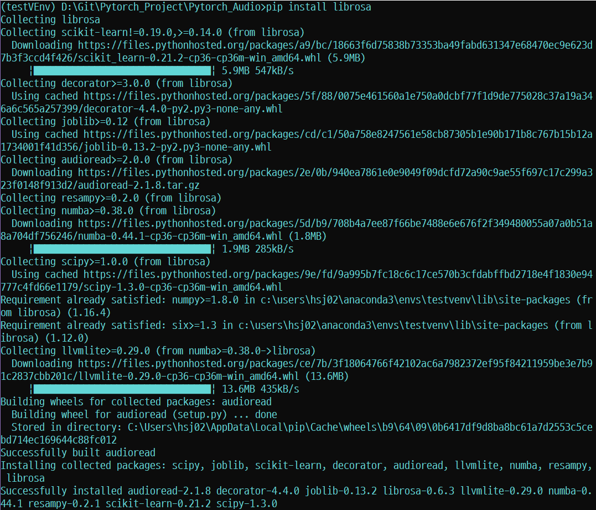

    ###### [Pydub]

    

    ###### [PyAudio]

    

- ##### 설치확인

  ```shell
  (testVenv)d:\Pytorch_Audio> pip list
  ```

  `pip list` 명령어를 통해 가상환경에 설치된 패키지를 확인할 수 있다.

  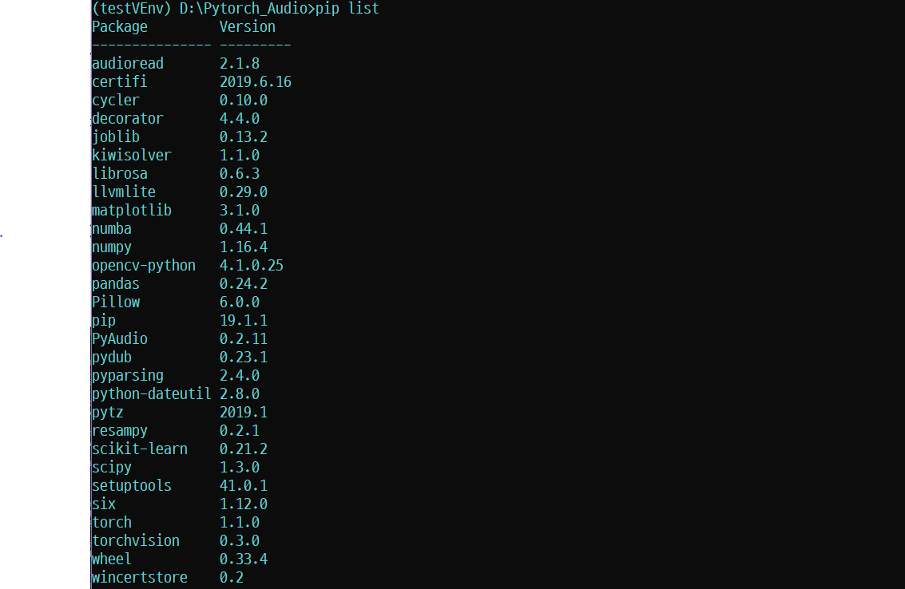

  필요한 라이브러리가 정상적으로 설치됨을 확인할 수 있다.

## 3. 데이터셋(UrbanSound) 다운로드

> 뉴욕 대학교 MARL(Music and Audio Research Lab)에서 2014 년에 공개한 UrbanSound는 10개의 클래스로 구성된 소리 데이터셋이다.

- ##### 사이트 접속

  - [UrbanSound_DataSet](https://urbansounddataset.weebly.com/urbansound.html)
  - 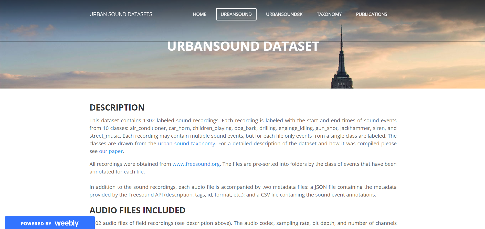

- ##### 신청서 작성

  - **UrbanSound**를 선택한 뒤 **DownLoad**를 클릭한다.
  - 그러면 다운로드 폼이 뜨는데, 형식에 맞게 작성하면 된다.
  - 메일로 **다운로드 링크 파일이 전송**이 된다.
  - 

- ##### 다운로드

  - 다운로드 후 **UrbanSound**폴더를 열어보면 다음과 같이 파일, 폴더가 구성 되어있다

  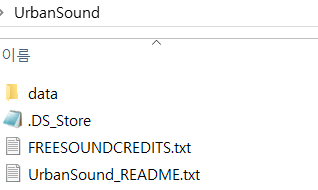

  - 그 중 **data**폴더를 열어보면 다음과 같이 **Class**별로 구별되어 있다

  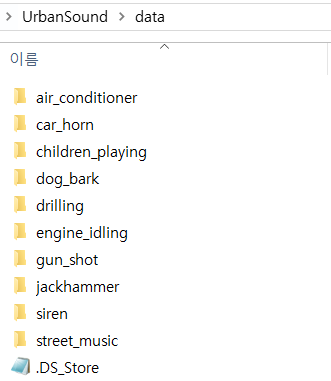

  

  - **air_conditioner**을 예시로 열어보니 다음과 같이 `.flac`, `.wav` 파일들이 닮겨 있다.

  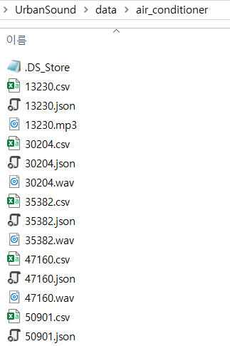

  

## 4. 전처리(1초 분할)

> 주어진 원데이터를 그대로 사용하면 불편하다. 그래서 원하는 형태로 변형해서 분석하는 경우가 많다. 따라서 분석에 용이하도록 데이터를 가공하는 작업을 **데이터 전처리**라고 한다.


- ##### Pydub

- ##### 소스 설명

  - **전체 소스**(`audio_preprocess.py`)

    ```python
    import os
    from pydub import AudioSegment
    from pydub.generators import WhiteNoise
    
    def main(args):
        urbansound_folder = args.urbansound_dir
        urbansound_dogbark_data_folder = urbansound_folder + os.sep + 'data/dog_bark'
        urbansound_graph_folder = urbansound_folder + os.sep + 'graph'
        urbansound_dogbark_graph_folder = urbansound_graph_folder + os.sep + 'positive'
        urbansound_other_graph_folder = urbansound_graph_folder + os.sep + 'negative'
    
        if not os.path.exists(urbansound_graph_folder):
            os.mkdir(urbansound_graph_folder)
        if not os.path.exists(urbansound_dogbark_graph_folder):
            os.mkdir(urbansound_dogbark_graph_folder)
        if not os.path.exists(urbansound_other_graph_folder):
            os.mkdir(urbansound_other_graph_folder)
    
        urbansound_other_data_folders = [urbansound_folder + os.sep + 'data/air_conditioner',
                                         urbansound_folder + os.sep + 'data/car_horn', \
                                         urbansound_folder + os.sep + 'data/children_playing',
                                         urbansound_folder + os.sep + 'data/drilling', \
                                         urbansound_folder + os.sep + 'data/engine_idling',
                                         urbansound_folder + os.sep + 'data/gun_shot', \
                                         urbansound_folder + os.sep + 'data/jackhammer',
                                         urbansound_folder + os.sep + 'data/siren', \
                                         urbansound_folder + os.sep + 'data/street_music']
    
        SECOND_MS = 500         #1000
        SEGMENT_MS = 500        #2000
        ASSIGNED_SAMPLERATE = 44100
        ESC50_AUDIO_START_POS = 500
        POSITIVE_SAMPLE_DB_TH = -40.0
    
    
        print('creating positive training set ..')
        idx = 0
    
        for file in os.listdir(urbansound_dogbark_data_folder):
            filename, extension = os.path.splitext(file)
            if extension == '.wav' or extension == '.ogg' or extension == '.mp3' or extension == '.flac' or extension == '.aif' or extension == '.aiff':
                # open sound file
                audiopath = urbansound_dogbark_data_folder + os.sep + file
                print(audiopath)
                audio = AudioSegment.from_file(audiopath).set_frame_rate(ASSIGNED_SAMPLERATE).set_channels(1).set_sample_width(2)[:]
                # open csv file
                csvpath = urbansound_dogbark_data_folder + os.sep + filename + '.csv'
                csv = open(csvpath, 'r')
                lines = csv.readlines()
                for line in lines:
                    start = float(line.split(',')[0]) * SECOND_MS
                    end = float(line.split(',')[1]) * SECOND_MS
                    chunk1 = (end - start) / 10
                    current = start
                    while 1:
                        outfile = urbansound_dogbark_graph_folder + os.sep + str(idx) + '_dogbark.wav'
                        idx += 1
                        audioclip = audio[current:current + SEGMENT_MS]
                        if len(audioclip) != SEGMENT_MS:
                            lack = SEGMENT_MS - len(audioclip) + 100  # 100 for default crossfade
                            noiseclip = WhiteNoise().to_audio_segment(duration=lack, volume=-50)
                            lastclip = audioclip.append(noiseclip)
                            if lastclip.dBFS > POSITIVE_SAMPLE_DB_TH:
                                lastclip.export(outfile, format='wav')
                            break
                        else:
                            if audioclip.dBFS > POSITIVE_SAMPLE_DB_TH:
                                audioclip.export(outfile, format='wav')
                        current += SEGMENT_MS
                        chunk2 = end - current
                        if chunk2 < chunk1:
                            break
                    # if current > end:
                    # break
                csv.close()
    
    
        print ('creating negative training set ..')
        idx = 0
        for other_data_folder in urbansound_other_data_folders:
            for file in os.listdir(other_data_folder):
                filename, extension = os.path.splitext(file)
                if extension == '.wav' or extension == '.ogg' or extension == '.mp3' or extension == '.flac' or extension == '.aif' or extension == '.aiff':
                    # open sound file
                    audiopath = other_data_folder + os.sep + file
                    print(audiopath)
                    try:
                        audio = AudioSegment.from_file(audiopath).set_frame_rate(ASSIGNED_SAMPLERATE).set_channels(1).set_sample_width(2)[:]
                        num_segment = len(audio) // SEGMENT_MS
                        for i in range(0, num_segment):
                            if i % 4 == 0:  # less sample :)
                                outfile = urbansound_other_graph_folder + os.sep + str(idx) + '_other.wav'
                                idx += 1
                                audio[i * SEGMENT_MS: (i + 1) * SEGMENT_MS].export(outfile, format='wav')
                    except:
                        print('failed to load this one ^^^^^')
    
    
    if __name__ == "__main__":
        import argparse
        parser = argparse.ArgumentParser()
        parser.add_argument('--urbansound_dir', '-u', dest='urbansound_dir', required=True)
        args = parser.parse_args()
        main(args)
    
    ```

    `audio_preprocess.py`은 크게 4개의 기능을 한다.

    1. 폴더 생성
    2. DogSound 1초 분할
    3. OtherSound 1초 분할
    4. argparse(명령행)

    

  - **폴더 생성**

    ```python
    urbansound_folder = args.urbansound_dir
        urbansound_dogbark_data_folder = urbansound_folder + os.sep + 'data/dog_bark'
        urbansound_graph_folder = urbansound_folder + os.sep + 'graph'
        urbansound_dogbark_graph_folder = urbansound_graph_folder + os.sep + 'positive'
        urbansound_other_graph_folder = urbansound_graph_folder + os.sep + 'negative'
    
        if not os.path.exists(urbansound_graph_folder):
            os.mkdir(urbansound_graph_folder)
        if not os.path.exists(urbansound_dogbark_graph_folder):
            os.mkdir(urbansound_dogbark_graph_folder)
        if not os.path.exists(urbansound_other_graph_folder):
            os.mkdir(urbansound_other_graph_folder)
    
        urbansound_other_data_folders = [urbansound_folder + os.sep + 'data/air_conditioner',
                                         urbansound_folder + os.sep + 'data/car_horn', \
                                         urbansound_folder + os.sep + 'data/children_playing',
                                         urbansound_folder + os.sep + 'data/drilling', \
                                         urbansound_folder + os.sep + 'data/engine_idling',
                                         urbansound_folder + os.sep + 'data/gun_shot', \
                                         urbansound_folder + os.sep + 'data/jackhammer',
                                         urbansound_folder + os.sep + 'data/siren', \
                                         urbansound_folder + os.sep + 'data/street_music']
    ```

    `os`라이브러리를 통해 저장소에 접근하고, `os.path.exist`를 사용하여 그 폴더의 존재 여부를 알 수 있다.

    만약 폴더가 존재하지 않는다면 `os.mkdir`을 사용하여 폴더를 생성해준다.

    

  - **DogSound**

    ```python
     print('creating positive training set ..')
        idx = 0
    
        for file in os.listdir(urbansound_dogbark_data_folder):
            filename, extension = os.path.splitext(file)
            if extension == '.wav' or extension == '.ogg' or extension == '.mp3' or extension == '.flac' or extension == '.aif' or extension == '.aiff':
                # open sound file
                audiopath = urbansound_dogbark_data_folder + os.sep + file
                print(audiopath)
                audio = AudioSegment.from_file(audiopath).set_frame_rate(ASSIGNED_SAMPLERATE).set_channels(1).set_sample_width(2)[:]
                # open csv file
                csvpath = urbansound_dogbark_data_folder + os.sep + filename + '.csv'
                csv = open(csvpath, 'r')
                lines = csv.readlines()
                for line in lines:
                    start = float(line.split(',')[0]) * SECOND_MS
                    end = float(line.split(',')[1]) * SECOND_MS
                    chunk1 = (end - start) / 10
                    current = start
                    while 1:
                        outfile = urbansound_dogbark_graph_folder + os.sep + str(idx) + '_dogbark.wav'
                        idx += 1
                        audioclip = audio[current:current + SEGMENT_MS]
                        if len(audioclip) != SEGMENT_MS:
                            lack = SEGMENT_MS - len(audioclip) + 100  # 100 for default crossfade
                            noiseclip = WhiteNoise().to_audio_segment(duration=lack, volume=-50)
                            lastclip = audioclip.append(noiseclip)
                            if lastclip.dBFS > POSITIVE_SAMPLE_DB_TH:
                                lastclip.export(outfile, format='wav')
                            break
                        else:
                            if audioclip.dBFS > POSITIVE_SAMPLE_DB_TH:
                                audioclip.export(outfile, format='wav')
                        current += SEGMENT_MS
                        chunk2 = end - current
                        if chunk2 < chunk1:
                            break
                    # if current > end:
                    # break
                csv.close()
    ```

    `UrbanSound`폴더 중 `/Dog_bark`폴더의 파일들에 접근한다.

    소리파일과 소리 위치가 담긴 `csv`파일을 통해 1초단위의 소리파일들을 생성한다.

    그 파일들은 `urbansound/graph/positive`에 저장된다.

    

  - **OtherSound**

    ```python
     print ('creating negative training set ..')
        idx = 0
        for other_data_folder in urbansound_other_data_folders:
            for file in os.listdir(other_data_folder):
                filename, extension = os.path.splitext(file)
                if extension == '.wav' or extension == '.ogg' or extension == '.mp3' or extension == '.flac' or extension == '.aif' or extension == '.aiff':
                    # open sound file
                    audiopath = other_data_folder + os.sep + file
                    print(audiopath)
                    try:
                        audio = AudioSegment.from_file(audiopath).set_frame_rate(ASSIGNED_SAMPLERATE).set_channels(1).set_sample_width(2)[:]
                        num_segment = len(audio) // SEGMENT_MS
                        for i in range(0, num_segment):
                            if i % 4 == 0:  # less sample :)
                                outfile = urbansound_other_graph_folder + os.sep + str(idx) + '_other.wav'
                                idx += 1
                                audio[i * SEGMENT_MS: (i + 1) * SEGMENT_MS].export(outfile, format='wav')
                    except:
                        print('failed to load this one ^^^^^')
    ```

    DogSound와 유사하지만 다른 class들을 모두 `OtherSound`로 분류한다는 것이 차이점이다. `csv`파일에 접근하지 않고 소리파일의 첫 1초만을 저장한다.

    그 파일들은 `urbansound/graph/negative`에 저장된다.

  

  - **argparse**

    ```python
    import argparse
        parser = argparse.ArgumentParser()
        parser.add_argument('--urbansound_dir', '-u', dest='urbansound_dir', required=True)
        args = parser.parse_args()
        main(args)
    ```

    `argparse`는 명령줄 파싱 라이브러리이다.

    ```shell
    (testVenv)d:\Pytorch_Audio>python audio_preprocess --urbansound_dir UrbanSound
    ```

    위와 같이 명령어를 입력하면, `--urbansound_dir`뒤의 문자열이 파싱되어 파일경로로 입력된다.


- ##### 실행 결과

  ```shell
  (testVenv)d:\Pytorch_Audio>python audio_preprocess.py --urbansound_dir UrbanSound
  ```
  
  위의 명령어를 입력하면 다음과 같이 전처리가 진행된다.
  
  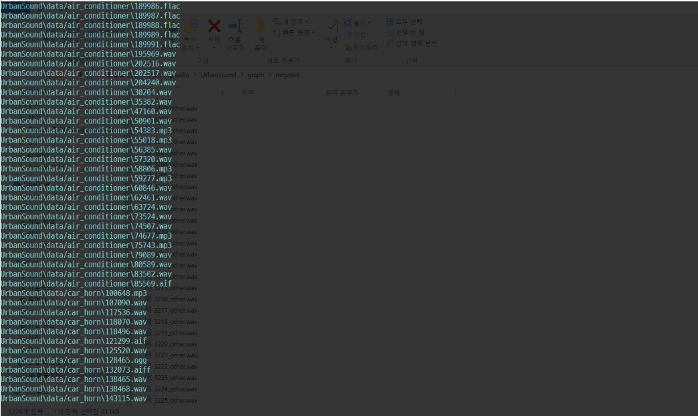

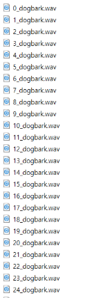

## 5. 전처리(Mfcc)

- ##### Librosa

  > **Librosa**는 음성 특징 추출 라이브러리로, 소리의 특징을 추출하는 것은 물론, 스펙트로그램 그래프로 변환할 수 있다.

- ##### Mfcc

  > **Mfcc**(Mel Frequency Cepstral Coefficient)는 **일정 구간**(Short time)식 나누어, 이 구간에 대한 **스펙트럼을 분석**하여 특징을 추출하는 기법이다.

- ##### 소스 설명

  - 전체 소스(`audio_mfcc.py`)

    ```python
    import os
    import librosa
    import librosa.display
    import numpy as np
    import matplotlib as mpl
    import matplotlib.pyplot as plt
    import matplotlib.pylab as pylab
    
    def main(args):
        urbansound_folder = args.urbansound_dir
        urbansound_graph_folder = urbansound_folder + os.sep + 'graph'
        urbansound_graph_mfcc_folder = urbansound_folder + os.sep + 'graph_mfcc'
        urbansound_dogbark_graph_folder = urbansound_graph_folder + os.sep + 'positive'
        urbansound_other_graph_folder = urbansound_graph_folder + os.sep + 'negative'
        urbansound_dogbark_graph_mfcc_folder = urbansound_graph_mfcc_folder + os.sep + 'positive'
        urbansound_other_graph_mfcc_folder = urbansound_graph_mfcc_folder + os.sep + 'negative'
    
        if not os.path.exists(urbansound_graph_mfcc_folder):
            os.mkdir(urbansound_graph_mfcc_folder)
        if not os.path.exists(urbansound_dogbark_graph_mfcc_folder):
            os.mkdir(urbansound_dogbark_graph_mfcc_folder)
        if not os.path.exists(urbansound_other_graph_mfcc_folder):
            os.mkdir(urbansound_other_graph_mfcc_folder)
    
    
        for file in os.listdir(urbansound_dogbark_graph_folder):
            filename, extension = os.path.splitext(file)
            
            if extension == '.wav':
                # open sound file
                audiopath = urbansound_dogbark_graph_folder + os.sep + file
                print(audiopath)
    
                y, sr = librosa.load(audiopath)
                S = librosa.feature.melspectrogram(y, sr=sr, n_mels=128)
    
                log_S = librosa.amplitude_to_db(S, ref=np.max)
                fig = plt.figure(figsize=(12, 4))
                librosa.display.specshow(log_S, sr=sr, x_axis='time', y_axis='mel')
    
                plt.title('mel power spectrogram')
                # plt.colorbar(format = '%+02.0f db')
                plt.tight_layout()
    
                plt.axis('off')
                plt.xticks([]), plt.yticks([])
                plt.subplots_adjust(left=0, bottom=0, right=1, top=1, hspace=0, wspace=0)
    
                plt.savefig(urbansound_dogbark_graph_mfcc_folder + '/' + filename + '.png')
                plt.close(fig)
    
        for file in os.listdir(urbansound_other_graph_folder):
            filename, extension = os.path.splitext(file)
            if extension == '.wav':
                # open sound file
                audiopath = urbansound_other_graph_folder + os.sep + file
                print(audiopath)
    
                y, sr = librosa.load(audiopath)
                S = librosa.feature.melspectrogram(y, sr=sr, n_mels=128)
    
                log_S = librosa.amplitude_to_db(S, ref=np.max)
                fig = plt.figure(figsize=(12, 4))
                librosa.display.specshow(log_S, sr=sr, x_axis='time', y_axis='mel')
    
                plt.title('mel power spectrogram')
                # plt.colorbar(format = '%+02.0f db')
                plt.tight_layout()
    
                plt.axis('off')
                plt.xticks([]), plt.yticks([])
                plt.subplots_adjust(left=0, bottom=0, right=1, top=1, hspace=0, wspace=0)
    
                plt.savefig(urbansound_other_graph_mfcc_folder + '/' + filename + '.png')
                plt.close(fig)
    
    if __name__ == "__main__":
        import argparse
        parser = argparse.ArgumentParser()
        parser.add_argument('--urbansound_dir', '-u', dest='urbansound_dir', required=True)
        args = parser.parse_args()
        main(args)
    
    
    ```

    `audio_mfcc.py`은 크게 4개의 기능을 한다.

    1. 폴더 생성
    2. DogSound 시각화 이미지 저장
    3. OtherSound 시각화 이미지 저장

  

  

  - **폴더 생성**

    ```python
    urbansound_folder = args.urbansound_dir
        urbansound_graph_folder = urbansound_folder + os.sep + 'graph'
        urbansound_graph_mfcc_folder = urbansound_folder + os.sep + 'graph_mfcc'
        urbansound_dogbark_graph_folder = urbansound_graph_folder + os.sep + 'positive'
        urbansound_other_graph_folder = urbansound_graph_folder + os.sep + 'negative'
        urbansound_dogbark_graph_mfcc_folder = urbansound_graph_mfcc_folder + os.sep + 'positive'
        urbansound_other_graph_mfcc_folder = urbansound_graph_mfcc_folder + os.sep + 'negative'
    
        if not os.path.exists(urbansound_graph_mfcc_folder):
            os.mkdir(urbansound_graph_mfcc_folder)
        if not os.path.exists(urbansound_dogbark_graph_mfcc_folder):
            os.mkdir(urbansound_dogbark_graph_mfcc_folder)
        if not os.path.exists(urbansound_other_graph_mfcc_folder):
            os.mkdir(urbansound_other_graph_mfcc_folder)
    ```

    `audio_preprocess.py`와 유사하다.

    `os`라이브러리를 통해 저장소에 접근하고, `os.path.exist`를 사용하여 그 폴더의 존재 여부를 알 수 있다.

    만약 폴더가 존재하지 않는다면 `os.mkdir`을 사용하여 폴더를 생성해준다.

    

  - **DogSound 시각화 이미지 저장**

    ```python
     for file in os.listdir(urbansound_dogbark_graph_folder):
            filename, extension = os.path.splitext(file)
            
            if extension == '.wav':
                # open sound file
                audiopath = urbansound_dogbark_graph_folder + os.sep + file
                print(audiopath)
    
                y, sr = librosa.load(audiopath)
                S = librosa.feature.melspectrogram(y, sr=sr, n_mels=128)
    
                log_S = librosa.amplitude_to_db(S, ref=np.max)
                fig = plt.figure(figsize=(12, 4))
                librosa.display.specshow(log_S, sr=sr, x_axis='time', y_axis='mel')
    
                plt.title('mel power spectrogram')
                # plt.colorbar(format = '%+02.0f db')
                plt.tight_layout()
    
                plt.axis('off')
                plt.xticks([]), plt.yticks([])
                plt.subplots_adjust(left=0, bottom=0, right=1, top=1, hspace=0, wspace=0)
    
                plt.savefig(urbansound_dogbark_graph_mfcc_folder + '/' + filename + '.png')
                plt.close(fig)
    ```

    1초 단위로 전처리된 `.wav`파일들을 `librosa`라이브러리를 이용해 분석한다.

    `librosa.feature.melspectrogram`으로 그래프 변환하고,

    `matplotlib`를 사용해 시각화한다.

    그 후 `.savefig`를 통해 폴더에 `.png`파일로 저장한다.

    특히 `plt.subplots_adjust(left=0, bottom=0, right=1, top=1, hspace=0, wspace=0)` 부분은 이미지에서 불필요한 부분을 제거하여 오직 스펙트럼이미지만 나오도록 하는 것이다.

  		###### [Example Image]

  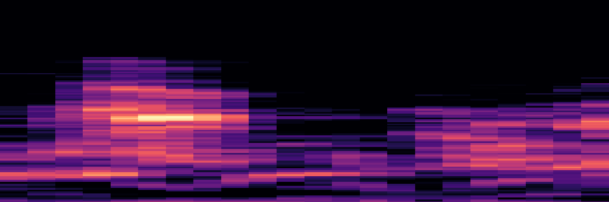

  - **OtherSound 시각화 이미지 저장**

    ```python
    for file in os.listdir(urbansound_other_graph_folder):
            filename, extension = os.path.splitext(file)
            if extension == '.wav':
                # open sound file
                audiopath = urbansound_other_graph_folder + os.sep + file
                print(audiopath)
    
                y, sr = librosa.load(audiopath)
                S = librosa.feature.melspectrogram(y, sr=sr, n_mels=128)
    
                log_S = librosa.amplitude_to_db(S, ref=np.max)
                fig = plt.figure(figsize=(12, 4))
                librosa.display.specshow(log_S, sr=sr, x_axis='time', y_axis='mel')
    
                plt.title('mel power spectrogram')
                # plt.colorbar(format = '%+02.0f db')
                plt.tight_layout()
    
                plt.axis('off')
                plt.xticks([]), plt.yticks([])
                plt.subplots_adjust(left=0, bottom=0, right=1, top=1, hspace=0, wspace=0)
    
                plt.savefig(urbansound_other_graph_mfcc_folder + '/' + filename + '.png')
                plt.close(fig)
    ```

    위의 `DogSound 시각화 이미지 저장`과 유사하다.

    ###### [Example Image]

  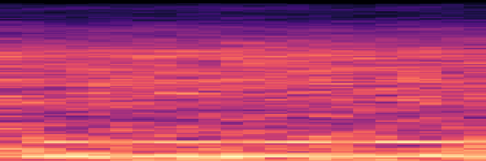

- ##### 실행 결과

  ```shell
  (testVenv)d:\Pytorch_Audio>python audio_mfcc.py --urbansound_dir UrbanSound
  ```

  위의 명령어를 입력하면 다음과 같이 **전처리**가 동작된다.

  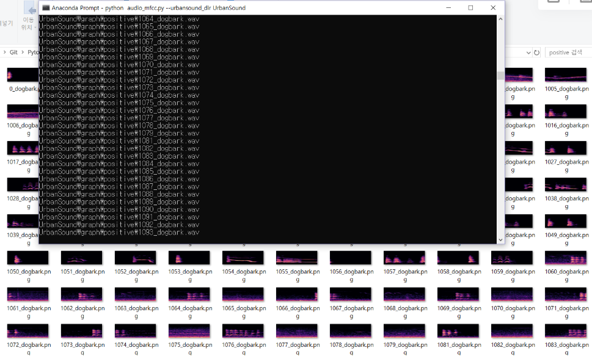


